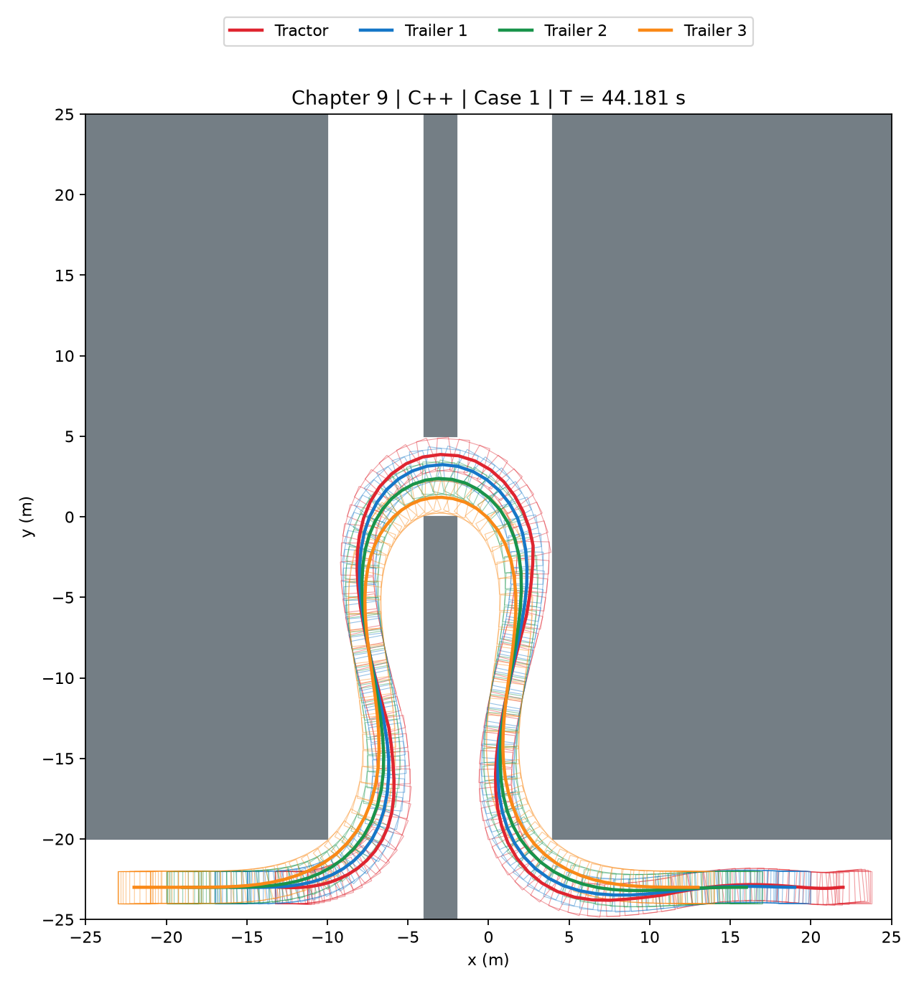
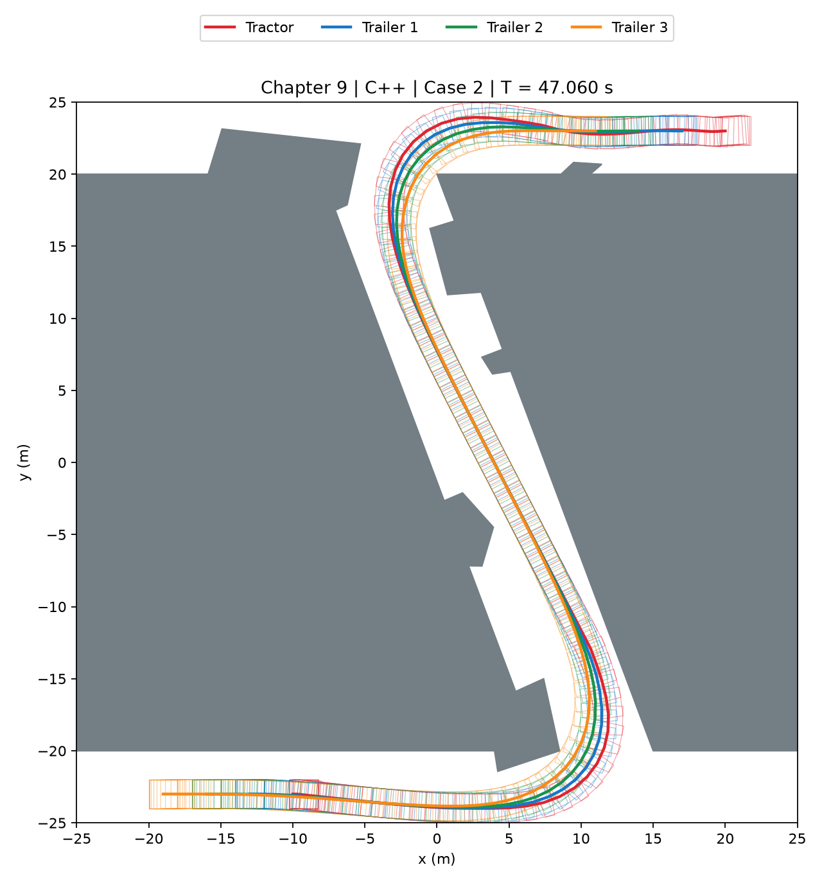
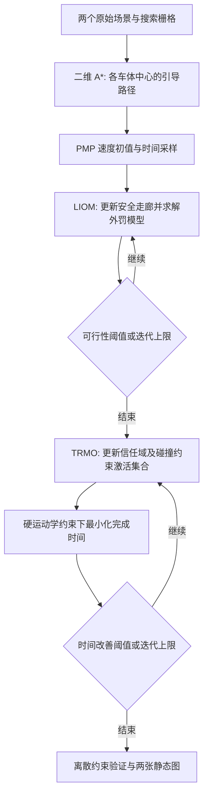

# Tractor–Trailer Trajectory Optimization

本仓库是中文图书 **《非结构化场景自动驾驶轨迹规划技术》** 第九章“杂乱非结构化场景中的多体铰接车轨迹规划”的配套 C++ 实现，对应第 9.3.3 节的三阶段规划方法。

English title translation: *Trajectory Planning Techniques for Autonomous Driving in Unstructured Environments*. **The book is written in Chinese.** The implementation uses C++17, CasADi and IPOPT to plan a minimum-time maneuver for one tractor towing three trailers through a curvy tunnel.

使用本代码开展研究并发表成果时，请引用：

> Bai Li, Li Li, Tankut Acarman, Zhijiang Shao, and Ming Yue, “Optimization-Based Maneuver Planning for a Tractor-Trailer Vehicle in a Curvy Tunnel: A Weak Reliance on Sampling and Search,” *IEEE Robotics and Automation Letters*, 7(2):706–713, 2022. [DOI: 10.1109/LRA.2021.3131693](https://doi.org/10.1109/LRA.2021.3131693).

正式卷期为 2022 年，在线发表年份为 2021 年。[BibTeX](CITATION.bib) 已附。

## 算例效果

两个地图及边界条件来自作者的原始代码，对应论文图 4。图片由本仓库 C++ 程序实际计算的轨迹生成。





每次运行导出两张静态 SVG 图：轨迹与四节车体足迹，以及状态与控制量。足迹在底层，轨迹在上层。

## 技术流程



1. **引导路径**：在膨胀栅格上分别搜索四个车体中心的二维 A* 路径，再附加由静止到静止的 PMP 速度初值。
2. **LIOM**：围绕当前参考轨迹重建四条 AABB 安全走廊，将非线性运动学误差写成二次外罚项，最小化 `T + 10000 × zeta`。边界、限幅和走廊约束保持为硬约束。
3. **TRMO**：围绕当前轨迹构建位置和角度信任域，通过采样筛选双向顶点避障约束，恢复硬运动学并最小化完成时间。若 LIOM 到达迭代上限，则按论文 Remark 2.2 将近可行解交给此阶段。

CasADi 负责表达式、稀疏导数和求解器接口，IPOPT 负责 NLP 求解。程序直接调用 C++ 接口；同一 LIOM 模型在外层迭代中复用。

### 主要参数

| 参数 | 设置 |
| --- | --- |
| 车辆 | 牵引车 + 3 节挂车；零铰点偏置 |
| 离散 | 100 个有限元区间，101 个配置点；前向 Euler |
| 牵引车 | 轴距 1.5 m，前后悬各 0.25 m，宽 2 m |
| 挂车 | 车体长 2 m、宽 2 m，前铰点至轮轴 3 m |
| 速度、加速度限幅 | 2.5 m/s、0.25 m/s² |
| 转角、转角速率限幅 | 0.7 rad、0.5 rad/s |
| 铰接角限幅 | `pi/2 - 0.1` rad |
| LIOM 外罚权重、误差阈值、迭代上限 | `1e4`、`1e-3`、5 |
| TRMO 位置、角度信任域半宽 | 3 m、`pi/4` rad |
| TRMO 时间改善阈值、迭代上限 | 1 s、10 |

这些设置对应论文表 I、式 (1)–(7) 和作者原始场景数据。本示例面向标准三挂车，不是任意数量、任意非零铰点偏置的通用车辆求解器。

## 安装

需要：

- C++17 编译器与 CMake 3.16 或更新版本。
- 带 IPOPT 插件的 [CasADi C++ 开发包](https://web.casadi.org/get/)；编译器须与该包的 ABI 兼容。
- 论文使用的 **HSL MA97** 及对应运行库。按 [HSL 官方渠道](https://licences.stfc.ac.uk/product/coin-hsl)取得许可和兼容版本，并确保 IPOPT 能加载它。

受保护的 A* 组件提供 Windows x64 和 Linux x86-64 二进制，通过稳定的 C 接口连接。Windows 已使用 MinGW-w64、CasADi 3.7.2 和 MA97 完成编译及双算例运行；Linux 库为交叉编译产物，需在目标 Linux 环境完成安装核验。Windows 的 CasADi、编译器和依赖库须采用兼容发行版。

### Linux x86-64

先安装编译工具，并将 CasADi 安装在自己的目录中。下面的路径需替换为实际安装位置：

```bash
sudo apt install build-essential cmake
git clone https://github.com/libai1943/tractor_trailer_traj_opt.git
cd tractor_trailer_traj_opt
cmake -S . -B build -DCMAKE_BUILD_TYPE=Release \
  -Dcasadi_DIR=/path/to/casadi/cmake
cmake --build build -j
export LD_LIBRARY_PATH=/path/to/casadi:/path/to/hsl/lib:$LD_LIBRARY_PATH
export HSL_LIBRARY=/path/to/hsl/lib/libcoinhsl.so
export OMP_NUM_THREADS=1
./build/trailer_demo --case 1
```

`casadi_DIR` 应指向包含 `casadi-config.cmake` 的目录。不同安装方式也可能将该目录放在 `lib/cmake/casadi` 下。

### Windows x64 / MinGW-w64

在 PowerShell 中配置工具和运行库路径。建议将工程和依赖放在英文路径，便于命令行构建工具工作：

```powershell
$env:PATH = "C:\mingw64\bin;C:\casadi;C:\hsl\bin;$env:PATH"
cmake -S . -B build -G "MinGW Makefiles" `
  -DCMAKE_BUILD_TYPE=Release -Dcasadi_DIR=C:/casadi/cmake
cmake --build build -j
$env:HSL_LIBRARY = 'C:\hsl\bin\libcoinhsl-2.dll'
$env:OMP_NUM_THREADS = '1'
.\build\trailer_demo.exe --case 1
```

HSL 库名称可能为 `libhsl.dll`、`libcoinhsl-2.dll` 或发行版指定的其他名称；所选库必须包含 MA97，不能仅依据文件名判断。其依赖的 BLAS/LAPACK、Fortran 运行库等也须可加载。CMake 会将本项目的 A* DLL 复制到可执行文件旁。

若当前 CasADi 发行版只提供 MUMPS，可显式选择：

```bash
./build/trailer_demo --case 1 --linear-solver mumps
```

默认线性求解器是 MA97。第三方求解器和运行库需按各自许可自行安装，不在本仓库重新分发。

## 用法与输出

从仓库根目录运行，`--case` 选择 `1` 或 `2`：

```bash
./build/trailer_demo --case 1 --output results
./build/trailer_demo --case 2 --output results
```

其他参数：

| 参数 | 含义 |
| --- | --- |
| `--data` | 场景数据位置，默认 `data/cases_data.bin` |
| `--output` | 输出根目录，默认 `results` |
| `--linear-solver` | IPOPT 线性求解器，默认 `ma97` |
| `--hsl-library` | HSL 动态库路径；也可用 `HSL_LIBRARY` 环境变量 |

输出写入 `results/case_1/` 或 `results/case_2/`：

- `trajectory.svg`：四节车体的轨迹与足迹，可直接用浏览器查看。
- `profiles.svg`：速度、朝向、加速度、前轮转角、转角速率和铰接角。
- `trajectory.csv`：101 个配置点的时间、状态与控制量。
- `validation.json`：真实规划耗时、预处理耗时、残差和验证状态。

每次都重新执行搜索与优化。数据包仅含场景、起终点和搜索地图，不包含预计算的答案轨迹。发生求解失败或最终验证失败时，程序返回非零退出码。验证针对配置点上的运动学、边界、限幅、矩形避障和车体自碰撞；不执行相邻配置之间的连续扫掠验证。

## 代码结构

| 文件 / 主要函数 | 功能 |
| --- | --- |
| `src/main.cpp` | 命令行参数、LIOM/TRMO 外层迭代、停止准则和真实计时 |
| `src/geometry.cpp` / `load_scenario` | 读取两个原始场景及搜索栅格 |
| `initial_guess` | 调用受保护的 A*，构造 PMP 速度初值和状态初值 |
| `build_corridors` | 按当前参考轨迹生成四条安全走廊 |
| `activate_constraints` | 采样信任域，筛选必要的双向顶点避障约束 |
| `src/optimizer.cpp` / `solve` | CasADi 建模与 IPOPT 求解；分别实现 LIOM 和 TRMO |
| `src/results.cpp` / `validate` | 独立检查离散运动学、限幅、边界和矩形相交 |
| `write_results` | CSV/JSON 输出及两张静态 SVG 图 |
| `include/planner.hpp` | 场景、车辆状态、轨迹和走廊的数据结构 |
| `include/guiding_search.h` | A* 组件的公开 C 接口 |
| `lib/` | 受保护的 A* 二进制组件，不包含搜索实现源码 |
| `data/cases_data.bin` | 两个场景的二进制数据 |

## 许可

采用 [PolyForm Noncommercial 1.0.0](LICENSE)。商业使用须另行获得作者许可；请保留 [NOTICE](NOTICE) 和论文引用。受保护搜索组件同样适用本项目许可。CasADi、IPOPT、HSL 和编译工具使用各自的许可。
