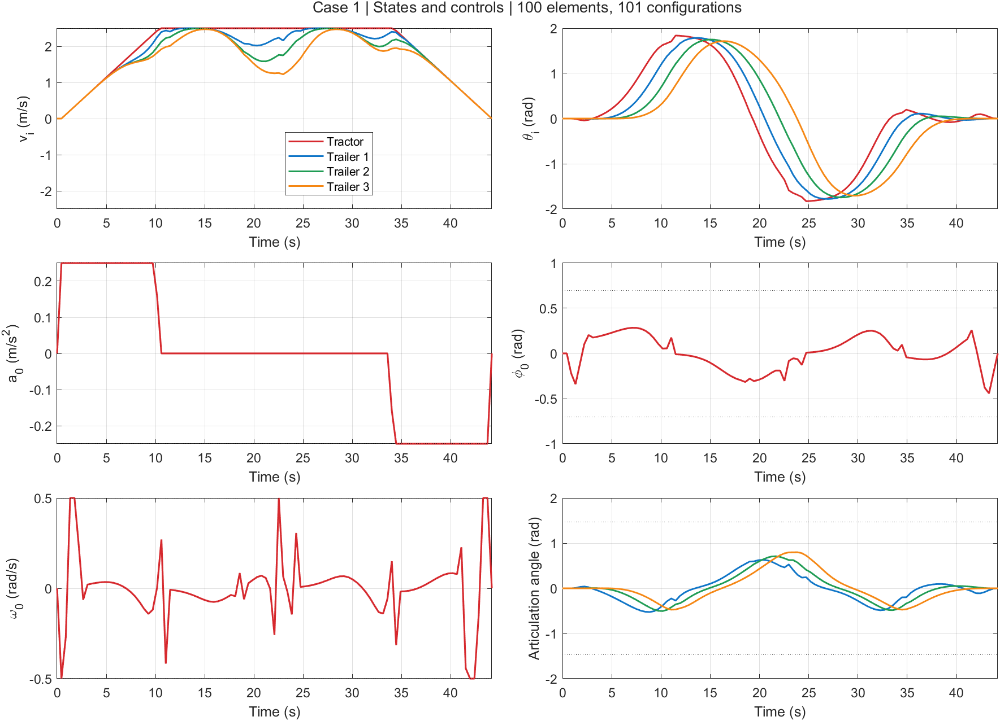
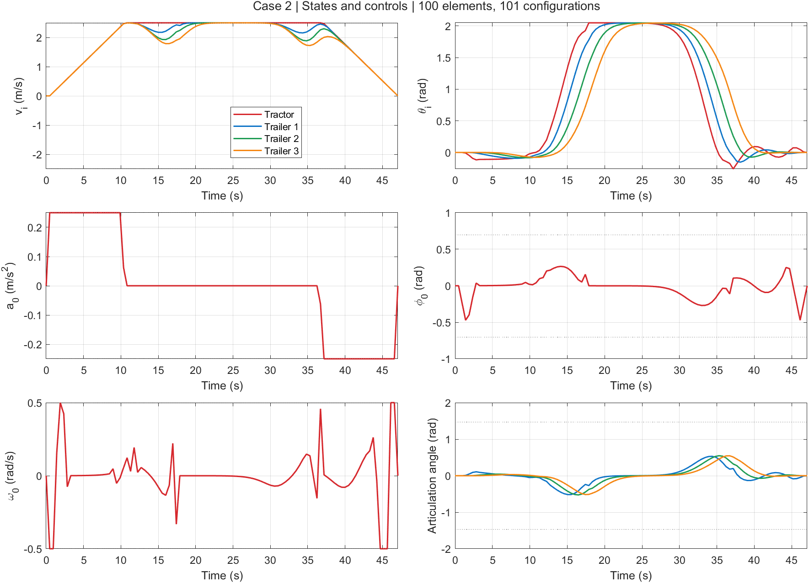
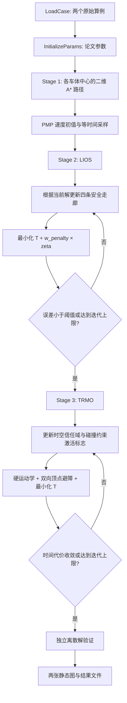

# Tractor–Trailer Trajectory Optimization · 第九章配套代码

本仓库配套中文图书 **《非结构化场景自动驾驶轨迹规划技术》** 第九章“杂乱非结构化场景中的多体铰接车轨迹规划”，具体实现第 9.3.3 节对应的三阶段轻量化迭代优化方法。

English title translation: *Trajectory Planning Techniques for Autonomous Driving in Unstructured Environments*. **The book is written in Chinese.** This MATLAB package implements the accompanying paper's three-stage tractor–trailer maneuver planner and its two original tunnel examples.

请在基于本代码开展研究并发表成果时引用：

> Bai Li, Li Li, Tankut Acarman, Zhijiang Shao, and Ming Yue, “Optimization-Based Maneuver Planning for a Tractor-Trailer Vehicle in a Curvy Tunnel: A Weak Reliance on Sampling and Search,” *IEEE Robotics and Automation Letters*, vol. 7, no. 2, pp. 706–713, April 2022. [DOI: 10.1109/LRA.2021.3131693](https://doi.org/10.1109/LRA.2021.3131693).

论文于 2021 年在线发表，正式卷期为 **2022 年**；[CITATION.bib](CITATION.bib) 使用正式卷期信息。本仓库只实现上述论文的方法，不包含书中另两类方法的完整实现。

## 两个原始算例

两个环境及起终点均来自作者提供的原始代码，对应论文图 4。这里的图片是整理后代码实际运行得到的结果。

### Case 1：U 形狭窄通道




### Case 2：杂乱弯曲通道




每个算例输出 **2 张静态图**：轨迹/足迹图，以及状态/控制量图。足迹先画在底层，再叠加四节车体的轨迹。静态绘图提供可读 M 文件；不包含视频功能、视频源码或视频 P-code。

## 安装与一键运行

实测环境为 Windows x64、MATLAB R2021b、Image Processing Toolbox，以及 AMPL/IPOPT。A* 自身随仓库提供 P-code；不需要 Navigation Toolbox、Optimization Toolbox 或 Parallel Computing Toolbox。

1. 安装 MATLAB 和 Image Processing Toolbox（用于障碍栅格膨胀）。
2. 从 [AMPL 官方文档](https://dev.ampl.com/ampl/install.html)安装 Windows AMPL，准备适合该模型规模的有效许可，并安装 IPOPT 的 AMPL 可执行版本及配套运行库。
3. 将本机 `ampl.exe`、`ipopt.exe` 及各自随发行包提供的 DLL 放在仓库根目录。保留完整配套运行库，避免混用不同发行版的 DLL。第三方可执行文件不在本仓库中重新分发。
4. 在 MATLAB 中打开 **`RunMe.m`**，设置 `case_id = 1` 或 `2`，点击 **Run**。

```matlab
case_id = 1; % 1 或 2
```

如求解器已安装在其他目录，可以先在 MATLAB 中指定位置：

```matlab
setenv('AMPL_EXECUTABLE','C:\ampl\ampl.exe');
setenv('IPOPT_EXECUTABLE','C:\ampl\ipopt.exe');
```

外部安装路径建议使用英文路径，以兼容旧版 AMPL。根目录本地求解器使用相对路径调用，可避免旧版 AMPL 的中文路径编码歧义。修改安装路径不涉及 MATLAB–AMPL API：本项目使用 **可执行文件 → `.run` 命令文件 → TXT 输出 → MATLAB 读取** 的交互方式。

`ipopt.opt` 默认使用论文中的 **MA97**。若你的 IPOPT 不含 MA97，需安装可用的对应发行版，或自行修改为该发行版支持的线性求解器；修改后结果和耗时可能有所不同。

运行 `RunExamples.m` 可从头计算两个算例并导出全部四张图片，窗口最后显示第二个算例。图像不是预先计算结果的替代输入，程序每次都会重新执行 A* 和优化。

## 方法与论文对应



| 阶段 | 本实现 | 论文位置 |
| --- | --- | --- |
| 1 | 四个车体中心分别进行二维栅格 A*，仅提供通道形态和同伦类别 | III-B |
| 初值 | 由静止到静止的标量最短时间速度规律，附着于粗路径并等时间采样 | III-C.1 |
| 2 | 基于当前参考解重建 AABB 走廊；非线性运动学作为二次外罚项；保留边界、限幅及走廊约束 | 式 (13)–(17)、算法 1（LIOS） |
| 3 | 围绕当前解采样信任域、筛选必要的顶点避障约束，恢复硬运动学并最小化完成时间 | 式 (18)–(19)、算法 2（TRMO） |
| 总流程 | A* → LIOS → TRMO | 算法 3 |

论文使用 **LIOS** 这一名称，本仓库沿用该名称，避免与其他章节的 LIOM 实现混淆。目标函数保持论文的完成时间 `T`；没有额外加入能耗、曲率、jerk 或平滑性目标。

本版专门提供论文的 **标准三挂车** 例子：一辆牵引车加三节挂车，共 4 个车体，铰点偏移均为零。它没有宣称已经实现一般非零偏置或任意挂车数量的完整求解器。

### 参数

| 参数 | 设置 | 来源 |
| --- | ---: | --- |
| 挂车数量 `NV` | 3 | 论文表 I |
| 有限元区间数 `NFE` | 100，即 **101 个配置点** | 论文表 I 与 III-C 的 `NFE+1` 定义 |
| 牵引车轴距 | 1.50 m | 表 I / 原代码 |
| 牵引车前、后悬 | 0.25 m、0.25 m | 原代码；牵引车前轮廓距后轴 1.75 m |
| 挂车车体前、后半长 | 1.00 m、1.00 m | 表 I / 原代码 |
| 车体宽度 | 2.00 m | 表 I |
| 各挂车轮轴至前铰点距离 | 3.00 m | 原代码 |
| 铰点偏置 | 0 m | 表 I |
| `vmax, amax` | 2.50 m/s、0.25 m/s² | 表 I |
| `Phi_max, Omega_max` | 0.70 rad、0.50 rad/s | 表 I |
| 最大铰接角 | `pi/2 - 0.1` rad | 式 (7)、表 I |
| 外罚权重 | `1e4` | 表 I |
| LIOS 误差阈值、迭代上限 | `1e-3`、5 | 表 I |
| 信任域位置/角度半宽 | 3.00 m、`pi/4` rad | 表 I |
| TRMO 时间改善阈值、迭代上限 | 1.0 s、10 | 表 I |

原始代码中名为 `nfe` 的变量实际上表示节点数量；本版明确区分 `NFE=100` 与 `nfe=101`。微分方程采用论文 IV 节说明的一阶显式 Runge–Kutta（前向 Euler）离散，修正原代码中部分分量的时刻索引不一致问题。因节点数、初值细节和数值求解环境不同，不保证逐位重现论文表 II 的代价或运行时间。

## 文件与函数

| 文件 | 功能 |
| --- | --- |
| `RunMe.m` | 第九章与论文说明、算例选择、一键运行 |
| `RunExamples.m` | 依次重新计算两个算例 |
| `PlanTrajectory.m` | 三阶段总流程、停止准则与最终验证 |
| `cases_data.mat` / `LoadCase.m` | 统一打包、读取两个原始场景及边界条件 |
| `InitializeParams.m` | 车辆和算法参数、NLP 常量与信任域采样设置 |
| `SearchGuidingPath.p` | 聚合的 A*、搜索栅格与启发函数；不提供同名 M 文件 |
| `WriteInitialGuess.m` | PMP 速度初值、路径时间采样；初值不要求满足多体运动学 |
| `SpecifyLocalBoxes.m` | 根据每轮解的车体中心更新 AABB 安全走廊 |
| `Feasibility.mod` | LIOS 中间优化模型 |
| `UpdateNlpFormulation.m` | 信任域参考、双向顶点避障约束的激活数据 |
| `Refinement.mod` | TRMO 的硬运动学、信任域、选择性避障模型 |
| `WriteSolutionGuess.m` | 为两个优化阶段写入完整初值，直接计算车身顶点 |
| `SolveNLP.m` | AMPL/IPOPT 文件交互、状态判定、完整精度结果回读 |
| `VehiclePolygon.m` | 根据轴位置、朝向计算四个车身顶点 |
| `ValidateSolution.m` | 独立检查离散运动学、边界、限幅、矩形足迹和车体自碰撞 |
| `PlotResults.m` | 开放的静态足迹、轨迹、状态与控制量绘图 |
| `ipopt.opt` | IPOPT 设置 |

原始临时测试脚本、点选工具、视频函数及其依赖没有进入发布目录。A* 的内容隐藏使用 MATLAB 官方 [P-code](https://www.mathworks.com/help/matlab/ref/pcode.html) 机制；静态绘图可直接阅读和修改。

## 输出与验证

每个算例的中间文件位于 `RunData/case_1/` 或 `RunData/case_2/`，由程序自行创建：

- `x.txt, y.txt, theta.txt, v.txt`：按车体顺序存储的完整精度数值；每个车体 101 个值。
- `a.txt, phy.txt, w.txt`：本次最终求解对应的控制量及前轮转角。
- `terminal_time.txt`、`status.txt`、`stage*.log`：完成时间、AMPL 数值状态及求解日志。
- `result.mat`、`validation.json`：结构化结果与独立验证报告。
- `docs/images/case*_trajectory.png`、`case*_profiles.png`：实际运行产生的静态图。

第二阶段用每轮新解更新走廊，第三阶段用每轮新解更新信任域；所有求解调用先清理待回读的旧 TXT，并检查数值状态。失败会明确报错，不会将旧结果或未通过验证的结果当作成功结果输出。

验证只针对 **101 个配置点** 及相邻点的 NLP 离散运动学等式，不加入相邻配置之间的连续扫掠碰撞证明。最终矩形足迹检查包含边交叉，以独立核对原模型输出。实际数值见 [docs/VALIDATION.md](docs/VALIDATION.md)。这里的“最优轨迹”指局部非线性优化所得解，不构成全局最优证明。

## 许可

本项目采用 [PolyForm Noncommercial 1.0.0](LICENSE)，保留 [NOTICE](NOTICE) 和论文引用。商业使用需要另行获得作者许可。A* P-code 也适用本项目许可。MathWorks、AMPL、IPOPT 及 HSL 使用各自许可，见 [THIRD_PARTY_NOTICES.md](THIRD_PARTY_NOTICES.md)；本仓库不重新分发这些第三方运行程序。
